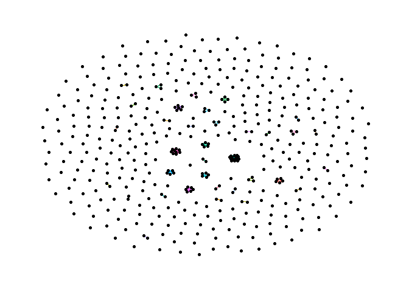

Exercise 1
================
Oleg Kartavtsev
5/9/2022

## Necessary Package Installation

``` r
#install.packages('ggraph')
#install.packages('tidygraph')
#install.packages('dplyr')
#install.packages('igraph')
```

## Importing the File

``` r
#reading the library 
library(igraph)
```

    ## Warning: package 'igraph' was built under R version 4.1.3

    ## 
    ## Attaching package: 'igraph'

    ## The following objects are masked from 'package:stats':
    ## 
    ##     decompose, spectrum

    ## The following object is masked from 'package:base':
    ## 
    ##     union

``` r
library(dplyr)
```

    ## 
    ## Attaching package: 'dplyr'

    ## The following objects are masked from 'package:igraph':
    ## 
    ##     as_data_frame, groups, union

    ## The following objects are masked from 'package:stats':
    ## 
    ##     filter, lag

    ## The following objects are masked from 'package:base':
    ## 
    ##     intersect, setdiff, setequal, union

``` r
library(tidygraph)
```

    ## Warning: package 'tidygraph' was built under R version 4.1.3

    ## 
    ## Attaching package: 'tidygraph'

    ## The following object is masked from 'package:igraph':
    ## 
    ##     groups

    ## The following object is masked from 'package:stats':
    ## 
    ##     filter

``` r
library(ggraph)
```

    ## Warning: package 'ggraph' was built under R version 4.1.3

    ## Loading required package: ggplot2

``` r
library(readr)
library(tidyverse)
```

    ## Warning: package 'tidyverse' was built under R version 4.1.3

    ## -- Attaching packages --------------------------------------- tidyverse 1.3.1 --

    ## v tibble  3.1.6     v stringr 1.4.0
    ## v tidyr   1.1.4     v forcats 0.5.1
    ## v purrr   0.3.4

    ## -- Conflicts ------------------------------------------ tidyverse_conflicts() --
    ## x tibble::as_data_frame() masks dplyr::as_data_frame(), igraph::as_data_frame()
    ## x purrr::compose()        masks igraph::compose()
    ## x tidyr::crossing()       masks igraph::crossing()
    ## x tidygraph::filter()     masks dplyr::filter(), stats::filter()
    ## x tidygraph::groups()     masks dplyr::groups(), igraph::groups()
    ## x dplyr::lag()            masks stats::lag()
    ## x purrr::simplify()       masks igraph::simplify()

``` r
connections <- read_csv("Connections.csv")
```

    ## Rows: 455 Columns: 6

    ## -- Column specification --------------------------------------------------------
    ## Delimiter: ","
    ## chr (6): First Name, Last Name, Email Address, Company, Position, Connected On

    ## 
    ## i Use `spec()` to retrieve the full column specification for this data.
    ## i Specify the column types or set `show_col_types = FALSE` to quiet this message.

``` r
#getting rid of NA values in the "Company" column
df <- connections[!(is.na(connections$Company) | connections$Company==""), ]
```

## Getting Total Count of all Connections

``` r
connections %>% count()
```

    ## # A tibble: 1 x 1
    ##       n
    ##   <int>
    ## 1   455

## Getting Count of all Connection by Company Name

``` r
df %>% 
  count(Company) %>% 
  arrange(-n)
```

    ## # A tibble: 359 x 2
    ##    Company                                                 n
    ##    <chr>                                               <int>
    ##  1 McGill University - Desautels Faculty of Management    15
    ##  2 SUNY New Paltz                                          9
    ##  3 Rogers Communications                                   6
    ##  4 Scotiabank                                              6
    ##  5 Air Transat                                             5
    ##  6 McGill University                                       5
    ##  7 McKesson Canada                                         5
    ##  8 Novartis                                                5
    ##  9 Freelance                                               4
    ## 10 Electronic Arts (EA)                                    3
    ## # ... with 349 more rows

## Coding the Graph

``` r
# Creating the label - using both full first and last names to avoid potential duplicates
df$label <- paste(df$`First Name`, df$`Last Name`)

# Creating nodes
nodes <- df %>% select(c("label", "Company"))
nodes <- nodes %>% rowid_to_column("id")

# Creating edges
edges <- df %>% select(c(label, Company)) %>% 
  left_join(nodes %>% select(c(id,label)), by = c("label"="label"))
edges <- edges %>% left_join(edges, by = "Company", keep=FALSE) %>% 
  select(c("id.x", "id.y", "Company")) %>% 
  filter(id.x!=id.y)
colnames(edges) <- c("x", "y", "Company")

#let's check what we got
edges %>% head(10)
```

    ## # A tibble: 10 x 3
    ##        x     y Company             
    ##    <int> <int> <chr>               
    ##  1     2     4 Electronic Arts (EA)
    ##  2     2     5 Electronic Arts (EA)
    ##  3     4     2 Electronic Arts (EA)
    ##  4     4     5 Electronic Arts (EA)
    ##  5     5     2 Electronic Arts (EA)
    ##  6     5     4 Electronic Arts (EA)
    ##  7     7     9 McKesson Canada     
    ##  8     7    77 McKesson Canada     
    ##  9     7    98 McKesson Canada     
    ## 10     7   144 McKesson Canada

## Plotting the results

``` r
graph <- tbl_graph(edges = edges, nodes=nodes, directed = FALSE)
ggraph(graph, layout = "graphopt") + 
  geom_edge_link(aes(color = Company), show.legend = FALSE) + 
  geom_node_point()+
  theme_graph()
```

<!-- -->
