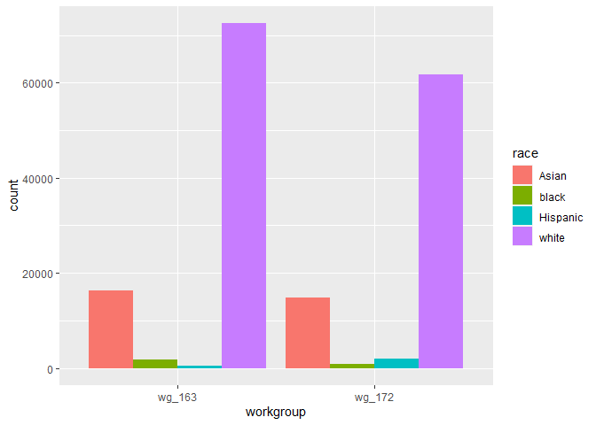
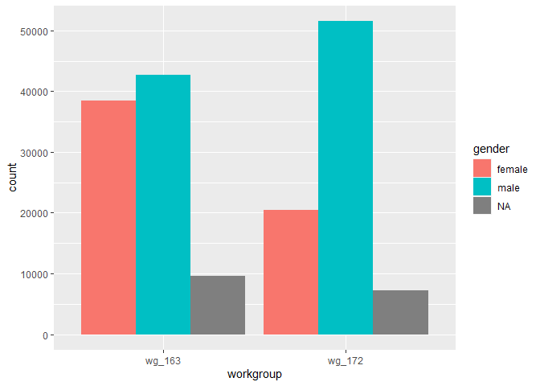
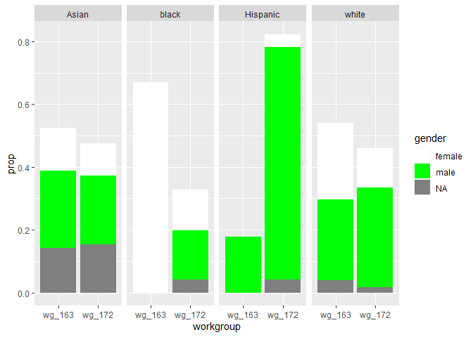
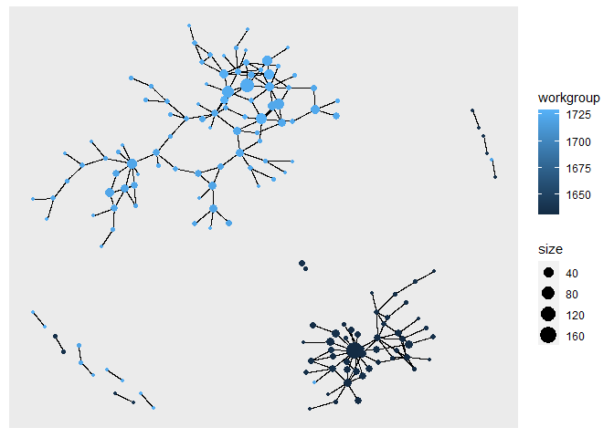
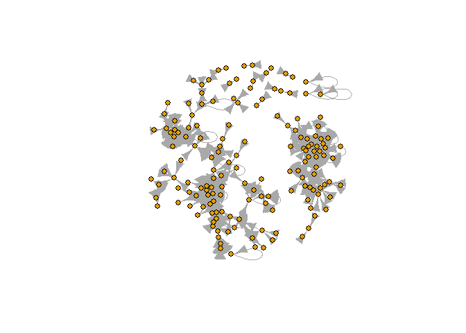

Exercise 3
================
Oleg Kartavtsev
5/24/2022

### Part 1: Importing the datasets, loading the libraries and adding “race”, “gender” and “tenure” columns

``` r
library(arrow)
```

    ## Warning: package 'arrow' was built under R version 4.1.3

    ## 
    ## Attaching package: 'arrow'

    ## The following object is masked from 'package:utils':
    ## 
    ##     timestamp

``` r
library(readr)
applications <- read_parquet(paste0('C:\\Users\\oleg1\\Desktop\\McGill\\Classes\\Organizational Network Analysis\\app_data_sample.parquet'))
edges <- read_csv(paste0('C:\\Users\\oleg1\\Desktop\\McGill\\Classes\\Organizational Network Analysis\\edges_sample.csv'))
```

    ## Rows: 32906 Columns: 4

    ## -- Column specification --------------------------------------------------------
    ## Delimiter: ","
    ## chr  (1): application_number
    ## dbl  (2): ego_examiner_id, alter_examiner_id
    ## date (1): advice_date

    ## 
    ## i Use `spec()` to retrieve the full column specification for this data.
    ## i Specify the column types or set `show_col_types = FALSE` to quiet this message.

``` r
library(gender)
library(tidyverse)
```

    ## Warning: package 'tidyverse' was built under R version 4.1.3

    ## -- Attaching packages --------------------------------------- tidyverse 1.3.1 --

    ## v ggplot2 3.3.5     v dplyr   1.0.7
    ## v tibble  3.1.6     v stringr 1.4.0
    ## v tidyr   1.1.4     v forcats 0.5.1
    ## v purrr   0.3.4

    ## -- Conflicts ------------------------------------------ tidyverse_conflicts() --
    ## x dplyr::filter() masks stats::filter()
    ## x dplyr::lag()    masks stats::lag()

``` r
#install_genderdata_package() # only run this line the first time you use the package, to get data for it

# get a list of first names without repetitions
examiner_names <- applications %>% 
  distinct(examiner_name_first)


# get a table of names and gender
examiner_names_gender <- examiner_names %>% 
  do(results = gender(.$examiner_name_first, method = "ssa")) %>% 
  unnest(cols = c(results), keep_empty = TRUE) %>% 
  select(
    examiner_name_first = name,
    gender,
    proportion_female
  )


# remove extra colums from the gender table
examiner_names_gender <- examiner_names_gender %>% 
  select(examiner_name_first, gender)

# joining gender back to the dataset
applications <- applications %>% 
  left_join(examiner_names_gender, by = "examiner_name_first")

# cleaning up
rm(examiner_names)
rm(examiner_names_gender)
gc()
```

    ##            used  (Mb) gc trigger  (Mb) max used  (Mb)
    ## Ncells  4575749 244.4    8178337 436.8  4595304 245.5
    ## Vcells 49665545 379.0   93187502 711.0 79981105 610.3

``` r
library(wru)

examiner_surnames <- applications %>% 
  select(surname = examiner_name_last) %>% 
  distinct()


examiner_race <- predict_race(voter.file = examiner_surnames, surname.only = T) %>% 
  as_tibble()
```

    ## [1] "Proceeding with surname-only predictions..."

    ## Warning in merge_surnames(voter.file): Probabilities were imputed for 698
    ## surnames that could not be matched to Census list.

``` r
examiner_race <- examiner_race %>% 
  mutate(max_race_p = pmax(pred.asi, pred.bla, pred.his, pred.oth, pred.whi)) %>% 
  mutate(race = case_when(
    max_race_p == pred.asi ~ "Asian",
    max_race_p == pred.bla ~ "black",
    max_race_p == pred.his ~ "Hispanic",
    max_race_p == pred.oth ~ "other",
    max_race_p == pred.whi ~ "white",
    TRUE ~ NA_character_
  ))


# removing extra columns
examiner_race <- examiner_race %>% 
  select(surname,race)

applications <- applications %>% 
  left_join(examiner_race, by = c("examiner_name_last" = "surname"))

rm(examiner_race)
rm(examiner_surnames)
gc()
```

    ##            used  (Mb) gc trigger  (Mb) max used  (Mb)
    ## Ncells  4988644 266.5    8178337 436.8  8178337 436.8
    ## Vcells 53460019 407.9   93187502 711.0 91651213 699.3

``` r
library(lubridate) # to work with dates
```

    ## 
    ## Attaching package: 'lubridate'

    ## The following object is masked from 'package:arrow':
    ## 
    ##     duration

    ## The following objects are masked from 'package:base':
    ## 
    ##     date, intersect, setdiff, union

``` r
examiner_dates <- applications %>% 
  select(examiner_id, filing_date, appl_status_date) 


examiner_dates <- examiner_dates %>% 
  mutate(start_date = ymd(filing_date), end_date = as_date(dmy_hms(appl_status_date)))

examiner_dates <- examiner_dates %>% 
  group_by(examiner_id) %>% 
  summarise(
    earliest_date = min(start_date, na.rm = TRUE), 
    latest_date = max(end_date, na.rm = TRUE),
    tenure_days = interval(earliest_date, latest_date) %/% days(1)
  ) %>% 
  filter(year(latest_date)<2018)

applications <- applications %>% 
  left_join(examiner_dates, by = "examiner_id")

rm(examiner_dates)
gc()
```

    ##            used  (Mb) gc trigger   (Mb)  max used   (Mb)
    ## Ncells  5003211 267.3   14723564  786.4  14723564  786.4
    ## Vcells 65839617 502.4  161644230 1233.3 161644230 1233.3

### Part 2: choosing to workgroups to focus on (in my case, 163 and 172) and printing out their summaries, as well as plotting the distribution of gender and race across these workgroups

``` r
#we pick 2 workgroups to focus on: 163 and 172

#creating a subset and summaries of the workgroup 163
wg163 <- subset(applications, grepl("^163", applications$examiner_art_unit))
wg163$gender <- factor(wg163$gender)
wg163$race <- factor(wg163$race)
summary(wg163$gender)
```

    ## female   male   NA's 
    ##  38491  42719   9650

``` r
summary(wg163$race)
```

    ##    Asian    black Hispanic    white 
    ##    16212     1762      406    72480

``` r
summary(wg163$tenure_days)
```

    ##    Min. 1st Qu.  Median    Mean 3rd Qu.    Max.    NA's 
    ##     251    6016    6296    6051    6339    6349    2820

``` r
#creating a subset and summaries of the workgroup 172
wg172 <- subset(applications, grepl("^172", applications$examiner_art_unit))
wg172$gender <- factor(wg172$gender)
wg172$race <- factor(wg172$race)
summary(wg172$gender)
```

    ## female   male   NA's 
    ##  20477  51533   7185

``` r
summary(wg172$race)
```

    ##    Asian    black Hispanic    white 
    ##    14716      863     1882    61734

``` r
summary(wg172$tenure_days)
```

    ##    Min. 1st Qu.  Median    Mean 3rd Qu.    Max.    NA's 
    ##     435    4800    6314    5553    6342    6350     145

``` r
#combining 2 datasets together (for plotting purposes)
library(dplyr)
wg163$workgroup <- c('wg_163')
wg172$workgroup <- c('wg_172')
combined <- union(x=wg163,y=wg172)
```

``` r
#plot gender and race across the workgroups
library(ggplot2)
ggplot(combined, aes(workgroup, ..count..)) + geom_bar(aes(fill = race), position = "dodge")
```

<!-- -->

``` r
ggplot(combined, aes(workgroup, ..count..)) + geom_bar(aes(fill = gender), position = "dodge")
```

<!-- -->

``` r
toPlot<-combined%>%
  group_by(workgroup, gender, race)%>%
  summarise(n = n())%>%
  group_by(race)%>%
  mutate(prop = n/sum(n))
```

    ## `summarise()` has grouped output by 'workgroup', 'gender'. You can override using the `.groups` argument.

``` r
ggplot(data = toPlot, aes(workgroup, prop, fill = gender)) + 
  geom_col() + 
  facet_grid(~race)+
  scale_fill_manual(values = c("white","green", "red", "blue"))
```

<!-- -->

Results of the analysis: workgroup 172 is significantly male-dominated
while workgroup 163 has only a slightly higher male distribution. In
addition, workers in both groups are predominantly White, with the Asian
workers having significance presence as well. Upon a closer look, it
seems that all Black workers in group 163 are female and practically all
Hispanic workers in both groups (more so in group 163) are male. The
male-female ratio is the closest to the equal among White workers in the
workgroup 163.

``` r
#setting up the variables and tables
library(igraph)
```

    ## Warning: package 'igraph' was built under R version 4.1.3

    ## 
    ## Attaching package: 'igraph'

    ## The following objects are masked from 'package:lubridate':
    ## 
    ##     %--%, union

    ## The following objects are masked from 'package:dplyr':
    ## 
    ##     as_data_frame, groups, union

    ## The following objects are masked from 'package:purrr':
    ## 
    ##     compose, simplify

    ## The following object is masked from 'package:tidyr':
    ## 
    ##     crossing

    ## The following object is masked from 'package:tibble':
    ## 
    ##     as_data_frame

    ## The following objects are masked from 'package:stats':
    ## 
    ##     decompose, spectrum

    ## The following object is masked from 'package:base':
    ## 
    ##     union

``` r
library(tidygraph)
```

    ## Warning: package 'tidygraph' was built under R version 4.1.3

    ## 
    ## Attaching package: 'tidygraph'

    ## The following object is masked from 'package:igraph':
    ## 
    ##     groups

    ## The following object is masked from 'package:stats':
    ## 
    ##     filter

``` r
library(ggraph)
```

    ## Warning: package 'ggraph' was built under R version 4.1.3

``` r
#creating a dataset with distinct information about only people from workgroups of our interest (in this case, 163 and 172) using both ego and alter nodes
distinct_groups = distinct(subset(applications, select=c(examiner_art_unit, examiner_id)))
distinct_groups$wg = substr(distinct_groups$examiner_art_unit, 1,3)
distinct_groups = distinct_groups[distinct_groups$wg==163 | distinct_groups$wg==172,]
merged = merge(x=edges, y=distinct_groups, by.x="ego_examiner_id", by.y="examiner_id", all.x=TRUE)
merged = merged %>% rename(ego_art_unit=examiner_art_unit, ego_wg=wg)
merged = drop_na(merged)
merged = merge(x=merged, y=distinct_groups, by.x="alter_examiner_id", by.y="examiner_id", all.x=TRUE)
merged = merged %>% rename(alter_art_unit=examiner_art_unit, alter_wg=wg)
merged = drop_na(merged)
#finalizing the nodes table
New_nodes = subset(merged, select=c(ego_examiner_id,ego_art_unit, ego_wg)) %>% rename(examiner_id=ego_examiner_id,art_unit=ego_art_unit,wg=ego_wg)
alterNodes = subset(merged, select=c(alter_examiner_id,alter_art_unit, alter_wg))%>% rename(examiner_id=alter_examiner_id,art_unit=alter_art_unit,wg=alter_wg)
nodes = rbind(New_nodes, alterNodes)
nodes = distinct(nodes)
nodes = nodes %>% group_by(examiner_id) %>% summarise(examiner_id=first(examiner_id), art_unit=first(art_unit), wg=first(wg))
```

``` r
#plotting the directed graph
graph1 = graph_from_data_frame(d=merged, vertices=nodes, directed=TRUE)

V(graph1)$workgroup = nodes$art_unit
```

``` r
Degree <- degree(graph1, v=V(graph1))
V(graph1)$size = Degree
ggraph(graph1, layout="kk") +
  geom_edge_link()+
  geom_node_point(aes(size=size, color=workgroup), show.legend=T)
```

<!-- -->

From this visualization (based on the degree centrality), it seems that
there isn’t much overlap between the two randomly chosen groups (except
for a handful of individual cases and a single outlier in one of the
larger sections of the network). Overall impression that this graph
creates is that people prefer to ask for an advice within their
respective workgroups.

``` r
e <- evcent(graph1)$vector
V(graph1)$evcent <- round(e,2)

plot(graph1, layout=layout.fruchterman.reingold,
    vertex.size = 6,          
    vertex.label = NA,
    vertex.label.cex = 0.8,   
    vertex.label.dist = 1.5,  
    vertex.label.color = "black",
    vertex.color = graph1$workgroup)
```

<!-- -->

Eigenvector is similar to degree centrality, but the difference is that
eigenvector also takes nodes’ power into account. This graph is
different from the previous one in the sense that there is much more
overlap between different groups, with clusters of homogenous workgroups
(denoted by identical colors) being present, but barely to the same
extent. This leads to the conclusion that, when we take into account
nodes’ relative power, there is a notable overlap between the
workgroups.

``` r
degree(graph1)
```

    ## 59156 59407 60203 60437 61047 61299 61416 61435 61517 61519 61863 62152 62312 
    ##     1     5    23     7     1    12     1     1     2    12    38   105    25 
    ## 62346 62413 62499 62621 62767 63027 63030 63176 63190 63234 63244 63649 63714 
    ##     1     3    28     1     1     5     3    37     1     2     4     1    15 
    ## 63977 64073 64074 64403 64917 65121 65131 66251 66344 66387 66958 66971 67034 
    ##    12    20     1    18     5     1     3     1     1     1     1    14    32 
    ## 67173 67259 67376 67515 67829 67973 68141 68719 69378 69464 69794 70248 70268 
    ##     8     1     2    18    49     1     8     3    10     1     2     4     2 
    ## 70423 70993 71087 71120 71123 71385 71720 71853 71931 72165 72253 72332 72591 
    ##     2     6    21     4     1     1     4     1    25     1   162     2     3 
    ## 72848 72995 73239 73880 74334 74342 74684 75367 75530 75933 76622 76629 76979 
    ##     2     1     2    10     7    15     2    19     7    30     2     1     3 
    ## 77298 77369 77651 77915 77958 78019 78144 78406 78715 79289 79495 80106 81337 
    ##    33     4    26    17     3     8     2     4     3     1     2     3     9 
    ## 81984 83034 83597 84267 85736 85940 86861 86985 87554 87892 88294 88443 89023 
    ##     9     3     1    24     1     1    14     1     1     1     1     1     4 
    ## 89192 90241 91210 91337 91374 92108 92143 92219 92510 92890 93553 93626 93663 
    ##     1     5     1     2     8     2    23     3     1     2     3     6     5 
    ## 93909 93955 93968 94161 94257 94466 94579 94782 94915 95010 95065 95091 95459 
    ##     5     1    32    16    15     4    16    50     1     1     1     6     6 
    ## 95525 95543 95565 95891 95970 96125 96339 96643 97102 97242 97431 97456 97481 
    ##     2    16     8     6     2     3    11     5     8     7     2    11     1 
    ## 97547 97586 97588 97603 97657 97755 97818 97884 97955 98182 98489 98614 98826 
    ##     1     4     1     2    13    19    38     1    12     3    19    26    71 
    ## 98852 99316 99381 
    ##    17     6     4

``` r
betweenness(graph1, directed = TRUE)
```

    ## 59156 59407 60203 60437 61047 61299 61416 61435 61517 61519 61863 62152 62312 
    ##     0     0     2     0     0     0     0     0     0    11     0     0     0 
    ## 62346 62413 62499 62621 62767 63027 63030 63176 63190 63234 63244 63649 63714 
    ##     0     0     0     0     0     0     0     8     0     0     0     0     0 
    ## 63977 64073 64074 64403 64917 65121 65131 66251 66344 66387 66958 66971 67034 
    ##     0     0     0     0     0     0     0     0     0     0     0     0     0 
    ## 67173 67259 67376 67515 67829 67973 68141 68719 69378 69464 69794 70248 70268 
    ##     0     0     0     0     0     0     0     0    20     0     0     0     0 
    ## 70423 70993 71087 71120 71123 71385 71720 71853 71931 72165 72253 72332 72591 
    ##     0     0     0     0     0     0     0     0     0     0    39     0     9 
    ## 72848 72995 73239 73880 74334 74342 74684 75367 75530 75933 76622 76629 76979 
    ##     0     0     0     0     0     0     0    12     0    12     0     0     0 
    ## 77298 77369 77651 77915 77958 78019 78144 78406 78715 79289 79495 80106 81337 
    ##     0     3     0     0     8     0     0     0     0     0     0     0     0 
    ## 81984 83034 83597 84267 85736 85940 86861 86985 87554 87892 88294 88443 89023 
    ##     0     0     0     0     0     0     0     0     0     0     0     0     8 
    ## 89192 90241 91210 91337 91374 92108 92143 92219 92510 92890 93553 93626 93663 
    ##     0     0     0     0     0     0     4     0     0     0     0     0     8 
    ## 93909 93955 93968 94161 94257 94466 94579 94782 94915 95010 95065 95091 95459 
    ##     0     0     0     0     0     0     0     0     0     0     0     0     0 
    ## 95525 95543 95565 95891 95970 96125 96339 96643 97102 97242 97431 97456 97481 
    ##     0     1     0     0     0     1     0     1     0     0     0     0     0 
    ## 97547 97586 97588 97603 97657 97755 97818 97884 97955 98182 98489 98614 98826 
    ##     0     0     0     0     0     0     0     0     1     0     0     0    33 
    ## 98852 99316 99381 
    ##    38     0     0

``` r
closeness(graph1)
```

    ##      59156      59407      60203      60437      61047      61299      61416 
    ##        NaN        NaN 0.50000000 1.00000000 1.00000000        NaN        NaN 
    ##      61435      61517      61519      61863      62152      62312      62346 
    ## 1.00000000        NaN 0.03225806 0.33333333        NaN 0.02380952        NaN 
    ##      62413      62499      62621      62767      63027      63030      63176 
    ##        NaN 0.25000000 1.00000000        NaN        NaN        NaN 0.11111111 
    ##      63190      63234      63244      63649      63714      63977      64073 
    ##        NaN        NaN 1.00000000        NaN        NaN        NaN        NaN 
    ##      64074      64403      64917      65121      65131      66251      66344 
    ## 0.05555556 0.33333333        NaN        NaN        NaN        NaN        NaN 
    ##      66387      66958      66971      67034      67173      67259      67376 
    ## 0.08333333 1.00000000        NaN        NaN        NaN 1.00000000        NaN 
    ##      67515      67829      67973      68141      68719      69378      69464 
    ## 0.02702703 0.14285714 1.00000000        NaN        NaN 0.16666667        NaN 
    ##      69794      70248      70268      70423      70993      71087      71120 
    ##        NaN 1.00000000 1.00000000 1.00000000        NaN 0.33333333 0.50000000 
    ##      71123      71385      71720      71853      71931      72165      72253 
    ## 1.00000000        NaN 0.11111111 1.00000000        NaN 0.08333333 0.06666667 
    ##      72332      72591      72848      72995      73239      73880      74334 
    ##        NaN 0.16666667        NaN 1.00000000 1.00000000        NaN        NaN 
    ##      74342      74684      75367      75530      75933      76622      76629 
    ##        NaN 1.00000000 0.33333333        NaN 0.14285714 0.50000000        NaN 
    ##      76979      77298      77369      77651      77915      77958      78019 
    ##        NaN 0.25000000 0.02040816 0.25000000 0.06250000 0.14285714        NaN 
    ##      78144      78406      78715      79289      79495      80106      81337 
    ## 0.16666667 0.20000000        NaN 0.07142857        NaN 1.00000000        NaN 
    ##      81984      83034      83597      84267      85736      85940      86861 
    ## 0.25000000        NaN 1.00000000        NaN 1.00000000        NaN        NaN 
    ##      86985      87554      87892      88294      88443      89023      89192 
    ##        NaN 0.07142857 1.00000000 1.00000000        NaN 0.11111111        NaN 
    ##      90241      91210      91337      91374      92108      92143      92219 
    ## 0.06250000 1.00000000 0.33333333        NaN        NaN 0.50000000        NaN 
    ##      92510      92890      93553      93626      93663      93909      93955 
    ## 1.00000000        NaN 0.25000000        NaN 0.50000000 0.25000000 1.00000000 
    ##      93968      94161      94257      94466      94579      94782      94915 
    ##        NaN        NaN        NaN        NaN        NaN        NaN 1.00000000 
    ##      95010      95065      95091      95459      95525      95543      95565 
    ##        NaN 1.00000000        NaN 0.50000000 0.50000000 1.00000000 1.00000000 
    ##      95891      95970      96125      96339      96643      97102      97242 
    ##        NaN 0.50000000 1.00000000 0.14285714 1.00000000 0.33333333        NaN 
    ##      97431      97456      97481      97547      97586      97588      97603 
    ##        NaN        NaN        NaN 1.00000000        NaN        NaN 1.00000000 
    ##      97657      97755      97818      97884      97955      98182      98489 
    ##        NaN        NaN        NaN        NaN 1.00000000 1.00000000 0.01886792 
    ##      98614      98826      98852      99316      99381 
    ##        NaN 0.03448276 0.02777778 0.33333333        NaN

Bonus: if our goal is not to look at the big picture but at individual
workers and their impact on the workplace, it would be more convenient
to calculate raw centrality scores, as it makes it easier to identify
distinct employer_ids. For example, according to the degree centrality,
employee with id “94782” is directly connected to 50 other employees
(nodes)! That’s quite impressive. Knowing their employer ID, we can
search it in the main “applications” dataset to get more information
regarding them.
