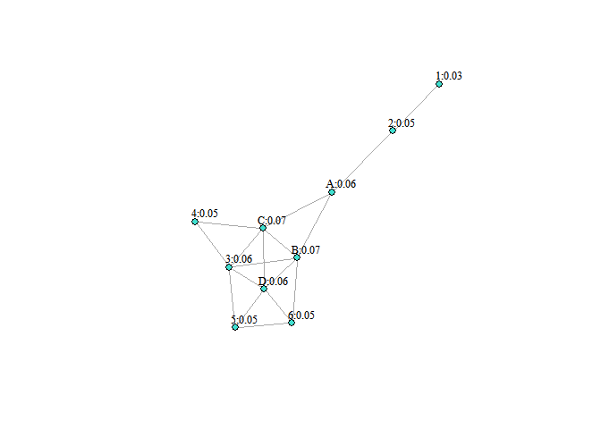
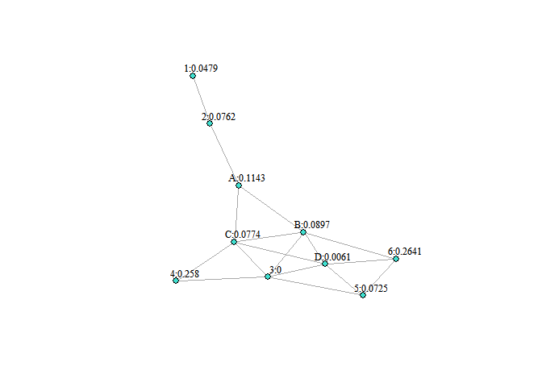
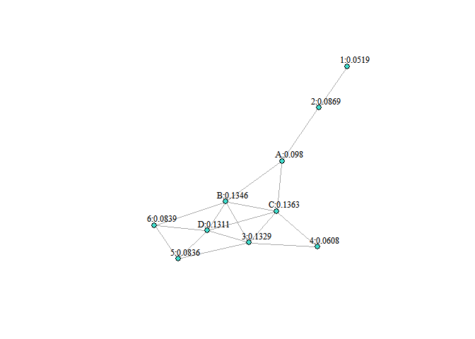

Exercise 2
================
Oleg Kartavtsev
5/12/2022

### Creating the edges list based on the drawing

``` r
library(igraph)
```

    ## Warning: package 'igraph' was built under R version 4.1.3

    ## 
    ## Attaching package: 'igraph'

    ## The following objects are masked from 'package:stats':
    ## 
    ##     decompose, spectrum

    ## The following object is masked from 'package:base':
    ## 
    ##     union

``` r
library(tidyverse)
```

    ## Warning: package 'tidyverse' was built under R version 4.1.3

    ## -- Attaching packages --------------------------------------- tidyverse 1.3.1 --

    ## v ggplot2 3.3.5     v purrr   0.3.4
    ## v tibble  3.1.6     v dplyr   1.0.7
    ## v tidyr   1.1.4     v stringr 1.4.0
    ## v readr   2.1.1     v forcats 0.5.1

    ## -- Conflicts ------------------------------------------ tidyverse_conflicts() --
    ## x dplyr::as_data_frame() masks tibble::as_data_frame(), igraph::as_data_frame()
    ## x purrr::compose()       masks igraph::compose()
    ## x tidyr::crossing()      masks igraph::crossing()
    ## x dplyr::filter()        masks stats::filter()
    ## x dplyr::groups()        masks igraph::groups()
    ## x dplyr::lag()           masks stats::lag()
    ## x purrr::simplify()      masks igraph::simplify()

``` r
dat <- read.table(text="A B 
1 2
2 A
A B
A C
B 6
B D
B C
B 3
C D
C 3
C 4
6 5
6 D
D 5
D 3
3 4
3 5", header=TRUE)
```

### Transforming the table into graph for calculating/plotting centrality

``` r
fakebook <- graph_from_data_frame(dat, directed=FALSE)
fakebook
```

    ## IGRAPH 821f19a UN-- 10 17 -- 
    ## + attr: name (v/c)
    ## + edges from 821f19a (vertex names):
    ##  [1] 1--2 2--A A--B A--C B--6 B--D B--C B--3 C--D C--3 C--4 6--5 6--D D--5 D--3
    ## [16] 3--4 3--5

### Calculating Degree Centrality - a count of how many edges each node has

``` r
degree(fakebook) 
```

    ## 1 2 A B C 6 D 3 4 5 
    ## 1 2 3 5 5 3 5 5 2 3

### Plotting Degree Centrality

``` r
V(fakebook)$degree <- degree(fakebook)

plot(fakebook, layout=layout.fruchterman.reingold,
    vertex.size = 6,          
    vertex.label = paste(V(fakebook)$name,V(fakebook)$degree,sep=":"),
    vertex.label.cex = 0.8,   
    vertex.label.dist = 1.5,  
    vertex.label.color = "black",
    vertex.color = "turquoise")
```

<!-- -->

From the graph above (degree centrality), it looks like seats B, C and D
would be the best ones, directly connecting with the most nodes (or
having the most edges)

### Calculating Betweenness Centrality - a counts how many shortest paths each node is on

``` r
betweenness(fakebook, directed = FALSE)
```

    ##          1          2          A          B          C          6          D 
    ##  0.0000000  8.0000000 14.0000000  9.0333333  8.6000000  0.9333333  3.2666667 
    ##          3          4          5 
    ##  4.6333333  0.0000000  0.5333333

### Plotting Betweenness Centrality

``` r
V(fakebook)$betweenness <- round(betweenness(fakebook),2)

plot(fakebook, layout=layout.fruchterman.reingold,
    vertex.size = 6,          
    vertex.label = paste(V(fakebook)$name,V(fakebook)$betweenness,sep=":"),
    vertex.label.cex = 0.8,   
    vertex.label.dist = 1.5,  
    vertex.label.color = "black",
    vertex.color = "turquoise")
```

<!-- -->

For betweenness centrality, A seems to be the best choice (14), followed
by B (9) and C (8.6), as they are on the highest number of shortest
paths

### Calculating Closeness Centrality - an average distance from one node to all other nodes.

``` r
closeness(fakebook)
```

    ##          1          2          A          B          C          6          D 
    ## 0.03333333 0.04545455 0.06250000 0.07142857 0.07142857 0.05263158 0.06250000 
    ##          3          4          5 
    ## 0.06250000 0.05000000 0.04761905

### Plotting Closeness Centrality

``` r
V(fakebook)$closeness <- round(closeness(fakebook),2)

plot(fakebook, layout=layout.fruchterman.reingold,
    vertex.size = 6,          
    vertex.label = paste(V(fakebook)$name,V(fakebook)$closeness,sep=":"),
    vertex.label.cex = 0.8,   
    vertex.label.dist = 1.5,  
    vertex.label.color = "black",
    vertex.color = "turquoise")
```

<!-- -->

For closeness centrality, B and C seem to be the best options (0.07
each), with the lowest average distance to other nodes

## Calculating Eigenvector Centrality - degree centrality + takes into account nodes’ power.

``` r
e <- evcent(fakebook)$vector
V(fakebook)$evcent <- round(e,2)

plot(fakebook, layout=layout.fruchterman.reingold,
    vertex.size = 6,          
    vertex.label = paste(V(fakebook)$name,V(fakebook)$evcent,sep=":"),
    vertex.label.cex = 0.8,   
    vertex.label.dist = 1.5,  
    vertex.label.color = "black",
    vertex.color = "turquoise")
```

<!-- -->

For eigenvector centrality, D is a top choice (1!) followed by B (0.97)
and C (0.94), as they are connected to the biggest number of most
powerful nodes.

### Calculating Bonacich Centrality - positive values imply that vertices become more powerful as their alters become more powerful (as occurs in cooperative relations)

``` r
V(fakebook)$bonacich <- power_centrality(fakebook, exponent = -2, rescale = T)
V(fakebook)$bonacich <- ifelse(V(fakebook)$bonacich < 0, 0, V(fakebook)$bonacich)

V(fakebook)$bonacich <- round(V(fakebook)$bonacich,4)

plot(fakebook, layout=layout.fruchterman.reingold,
    vertex.size = 6,          
    vertex.label = paste(V(fakebook)$name,V(fakebook)$bonacich,sep=":"),
    vertex.label.cex = 0.8,   
    vertex.label.dist = 1.5,  
    vertex.label.color = "black",
    vertex.color = "turquoise")
```

<!-- -->

According to Bonacich Centrality, seats A (0.11), B (0.09) and C (0.08)
are the best options

### Calculating Page Rank - most commonly encountered node along random walks

``` r
V(fakebook)$page_rank <- page_rank(fakebook, directed = TRUE)$vector
V(fakebook)$page_rank <- round(V(fakebook)$page_rank,4)

plot(fakebook, layout=layout.fruchterman.reingold,
    vertex.size = 6,          
    vertex.label = paste(V(fakebook)$name,V(fakebook)$page_rank,sep=":"),
    vertex.label.cex = 0.8,   
    vertex.label.dist = 1.5,  
    vertex.label.color = "black",
    vertex.color = "turquoise")
```

<!-- -->

According to Page Rank, C (0.1363), B (0.1346) and D (0.1311) are all
good choices, as they are the most commonly encountered (memorable)

### To sum up:

To make a final decision, we must think about the context of the
problem: picking the best seat on the bus. A is a clear favorite
according to the betweenness centrality, but it wouldn’t matter to us
since people on the bus will be sitting down most of the time and
unlikely to pass messages to each other, therefore I propose to not
consider A as the best solution. As to the other seats, B and D seem to
consistently have the highest scores, so both of these answers would
satisfy us. Considering that, as mentioned previously, we would be
sitting down most of the time, Eigenvector Centrality is our priority
since it counts number of other people we are directly connected to +
their relative power. Seat D is a clear favorite in that regard, meaning
that it would provide us with the best opportunity to make good
connections that can eventually introduce us to the rest of the people
on the bus. Therefore, my answer for this problem is seat D.
